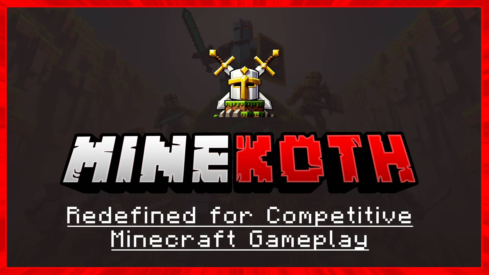

# MineKoth: Master King of the Hill Events in Minecraft

Welcome to MineKoth, a specialized plugin framework for implementing dynamic King of the Hill (KOTH) events on your Minecraft server. MineKoth simplifies creating, managing, and scheduling these events, enabling server administrators to deliver exciting competitive gameplay to their players.

## Features

- **KOTH Event System**: Easily create and manage King of the Hill events.
- **Scheduling Support**: Automate event timing with an advanced schedule manager.
- **Interactive Setup**: Configure KOTH events with an intuitive setup system.
- **PlaceholderAPI Integration**: Extend functionality with placeholders for in-game data display.
- **Event Management**: Includes tools for real-time event handling and player interactions.
- **Performance Optimized**: Designed for efficient resource utilization.

## MineKoth API Overview

The MineKoth API allows developers to:
- Create custom KOTH events programmatically.
- Interact with active events, players, and capture zones.
- Extend and customize gameplay mechanics tied to KOTH events.

For detailed API usage, refer to the code examples in the documentation or explore the source files.

## Getting Started

1. Clone the repository: `git clone https://github.com/arkflame/MineKoth.git`
2. Configure the plugin:
   - Define capture points and schedules in the configuration.
   - Use the `/koth` command to manage events in-game.
3. Start your Minecraft server and watch the competition unfold.

## Contributing

We welcome contributions to improve MineKoth. Here's how you can get involved:
- Fork the repository.
- Make your changes.
- Submit a pull request.

Your contributions help make MineKoth better for the Minecraft community!

## Support

Need help or have questions? Reach out to us:
- [GitHub Issues](#link-to-issues): Report bugs or request features.
- [Discord Community](#link-to-discord): Join our community for discussions and support.
- [Email Support](#email-address): Contact us for direct assistance.

## License

This project is licensed under the [MIT License](LICENSE).
